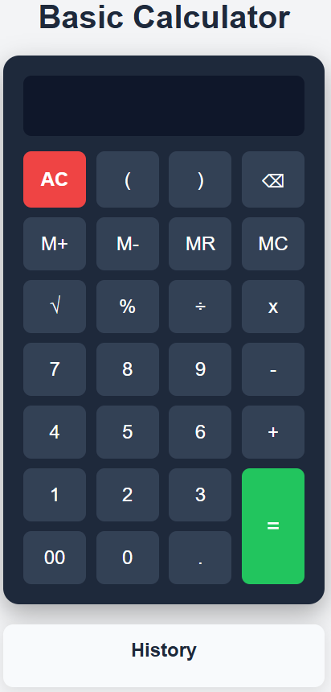
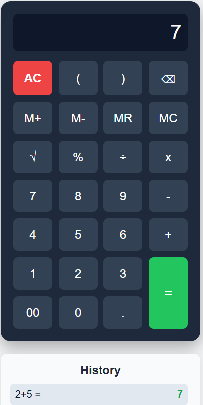
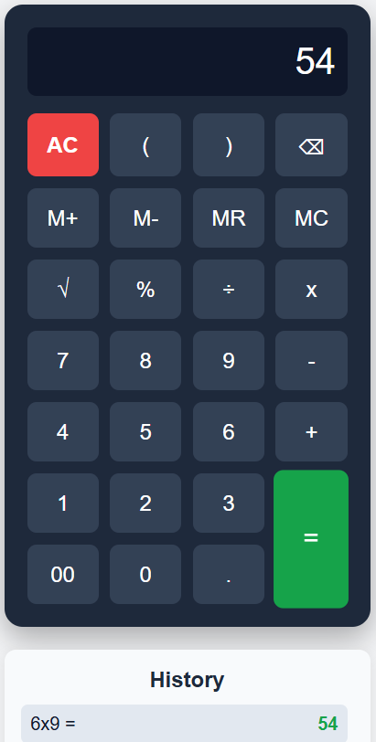
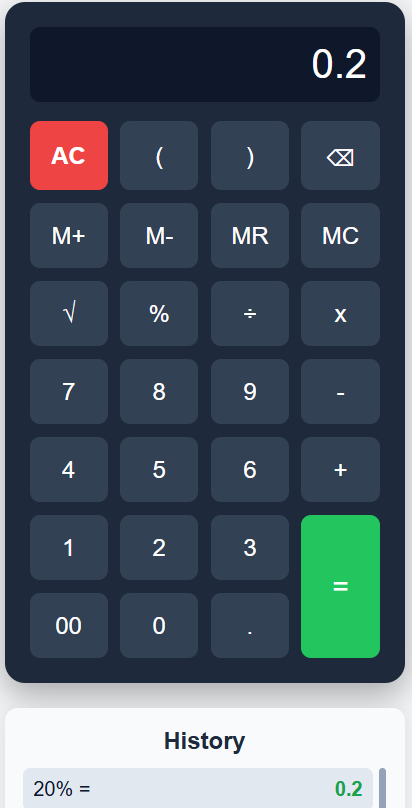

# 🧮 Basic Calculator  

A simple, elegant, and responsive **web-based calculator** built using **HTML**, **CSS**, and **JavaScript**.  
It performs standard arithmetic operations and includes additional features such as **calculation history** and **square root (√)** functionality.

---

## 🖼️ Preview  
<table>
   <tr>
      <td align="center">
         <h4>🧮 Calculator</h4>
         
      </td>
      <td align="center">
         <h4>➕ Addition</h4>
         
      </td>
   </tr>

   <tr>
      <td align="center">
         <h4>➖ Subtraction </h4>
         
      </td>
      <td align="center">
         <h4>✖️ Multiplication</h4>
         
      </td>
   </tr>

   <tr>
      <td align="center">
         <h4>➗ Division </h4>
         
      </td>
      <td align="center">
         <h4>📊 Percentage</h4>
         
      </td>
   </tr>

   <tr>
      <td align="center">
         <h4>🔢 Modulus </h4>
         
      </td>
      <td align="center">
         <h4>√ Square Root</h4>
         
      </td>
   </tr>
</table>
  
---

## 🚀 Features  

### 🔢 Basic Operations  
- Perform addition (`+`), subtraction (`-`), multiplication (`×`), and division (`÷`)  
- Supports decimal numbers and parentheses `( )`  
- Handles percentage (`%`) calculations  
- Includes **square root (`√`)** functionality  

### 🕒 Calculation History  
- Automatically saves your **last 5 calculations**  
- Click any previous expression to reuse it instantly  
- Avoids duplicate entries (e.g., pressing `=` repeatedly won’t add `5 = 5` again)

### ⌨️ Keyboard Support  
| Key | Function |
|------|-----------|
| `0–9` | Enter numbers |
| `+`, `-`, `*`, `/`, `%` | Operators |
| `Enter` | Calculate result |
| `Backspace` | Delete last digit |
| `C` / `c` | Clear display |
| `(` / `)` | Parentheses |

---

## 🖥️ How to Use  

1. **Open the Calculator:**  
   Launch the `index.html` file in your web browser.  

2. **Enter an Expression:**  
   Use on-screen buttons or your keyboard to enter a mathematical expression.  
   Example:  

3. **Calculate:**  
Press `=` or hit **Enter** to display the result.  

4. **View or Reuse History:**  
Your last 5 calculations appear below the display.  
Click on any history item to reuse that expression.  

5. **Square Root Calculation:**  
Click the **√** button to find the square root of a number.  
Example:  

---

## 🎨 Design & Responsiveness  

- Clean and modern dark theme  
- Responsive layout (works on desktop, tablet, and mobile)  
- Hover effects for an interactive experience  
- Scrollable and clickable **history list**

---

## ⚙️ Technical Details  

**Built With:**  
- **HTML5** – Structure and layout  
- **CSS3** – Styling and responsive design  
- **JavaScript (ES6)** – Calculator logic and event handling  

**Core JavaScript Functions:**  
- Evaluates user input using safe string parsing  
- Replaces operators for valid JS evaluation (`×` → `*`, `÷` → `/`, `√` → `Math.sqrt`)  
- Maintains a history array (maximum 5 entries)  
- Prevents adding duplicate history records  

---

## 🧩 Additional Features  

✅ **History Feature** — saves your last 5 calculations and allows click-to-reuse  
✅ **Square Root (√)** — computes square roots instantly  

---

## 📁 Folder Structure  

Basic-Calculator/

├── images

└──── screenshot.png # (Optional) Screenshot preview

└── index.html # Calculator layout

└── README.md # Project documentation

└── script.js # Calculator logic

└──
 styles.css # Styling and responsiveness

